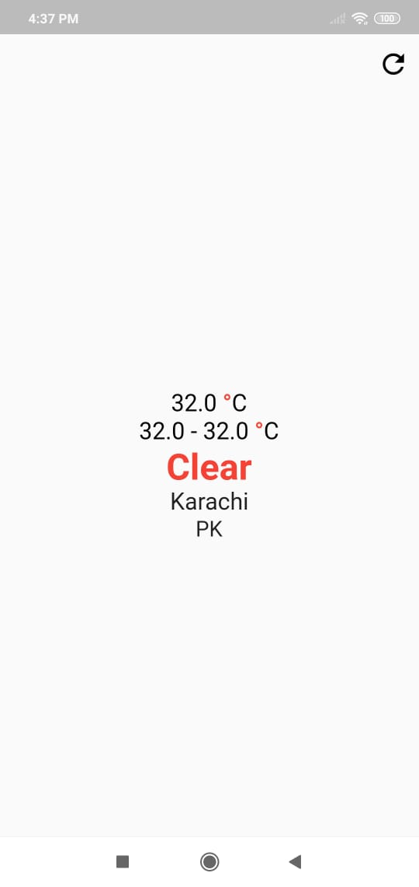

# VD_flutter_training_4

## Weather App with network call

## Acknowledgement
Thanks to the [Open Weather Map](https://openweathermap.org/current) for their free weather data API which I used in this project for getting weather data. Although the number of requests for free are limited but get the task done for demo purposes.

## About project
This project demonstrates calling of network calls and displaying data on the user interface. You can also observe smart usage of async and wait keywords. 
The final thing I would like to mention is JSON parsing.

# Screenshots

## Fetching Data

## Data Loaded
